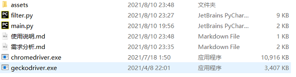
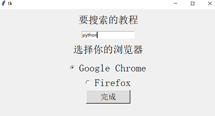
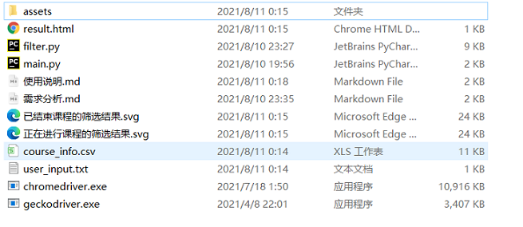

## 运行环境

------

操作系统：win10

python版本：3.9.6 

浏览器：Google Chrome或Firefox

selenium版本：3.141.0

pygal版本：2.4.0

## 如何操作

------

①项目根目录下的初始文件如下图

assets文件夹下面存放的是"使用说明.md"和"需求分析.md"所要用到的图片

chromedriver.exe是Google Chrome的驱动程序(版本：92.0.4515.107)

geckodriver是Firefox的驱动程序(版本：v0.29.1)

②如果您的Google Chrome版本为 92或Firefox版本>=60，此步骤可跳过

否则，请下载对应版本的驱动程序，放在项目根目录下

ChromeDriver下载地址:https://chromedriver.chromium.org/downloads

geckodriver下载地址:http://npm.taobao.org/mirrors/geckodriver/

③安装selenium库

使用命令conda install selenium 或者 pip install selenium

④安装selenium库

使用命令conda install pygal 或者 pip install pygal

⑤使用pycharm或命令行运行main.py，出现如下界面后，请填写信息并按“完成”按钮

⑥等待30-40秒,  项目将新增几个文件

course_info.csv存放的是爬取的课程信息

user_input存放用户在GUI界面中输入的信息

result.html是对"已结束课程的筛选结果.svg"和"正在进行课程的筛选结果.svg"这两张图表的一个整合

用浏览器打开result.html即可看到最后的效果
