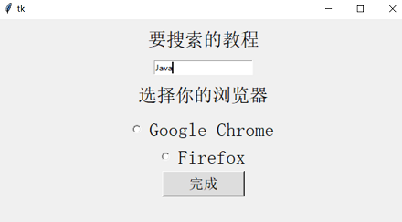
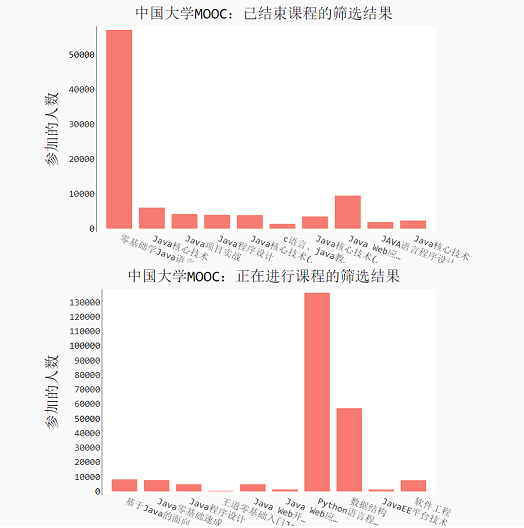
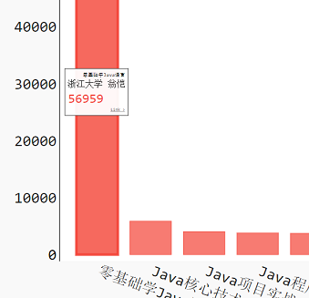

## 程序的目的

------

我们常常会在中国大学MOOC(慕课)上搜索教程来学习

但是它目前的筛选功能只有如下几个

但是，有如下三类课程我们往往是不需要的

①已经结束的课程，但是点进去显示"老师已关闭该学期，无法查看"

②一些学校专有的，需要邀请码的课程

③付费课程

在这些课程中，有的必须要点进去才能了解到它要付费或者无法查看，费时费力

而慕课上面暂时还没有这样的分类功能

所以本程序就是对课程数据的一个筛选，留下免费并且可以查看的课程

## 使用的技术

------

①调用了python内置的Tkinter 库，做了一个GUI界面，用于和用户交互

②调用python的第三方库selenium，用于获取网页上的课程数据

③调用python的第三方库pygal，用于对筛选后的课程数据进行可视化，pygal能够生成可交互的svg图像

## 效果

------

①GUI界面

②数据可视化

考虑到后面几页的课程匹配度不高，所以只展示前面的一些课程

③鼠标悬浮在柱形图上可查看具体信息

④点击柱状图可立即跳转到慕课上对应课程所在的网页

## 改进空间

------

①程序运行时间较长，一般爬取三页课程、筛选、绘图，总共要30-40秒时间

②在慕课上，大部分课程首页的页面结构都差不多，但是难免会有一些页面有特殊样式，这对数据的爬取造成了困难

